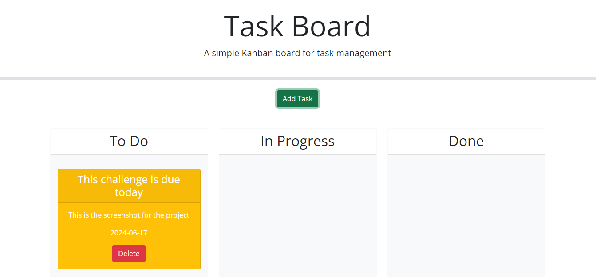

# Task-Board

## Description

Provide a short description explaining the what, why, and how of your project. Use the following questions as a guide:

- What was your motivation?
    My motivation was to be able to allow the user to plan out what they have to do using an online task board. 
- Why did you build this project? (Note: the answer is not "Because it was a homework assignment.") 
    This project was built in the hopes of allowing a user to interact with a website that remember what they planned to due on a certain day and indicate what state that objective is in such as: late, about to be due and an indication of coming up in the future.
- What problem does it solve?
    This will help the user keep track of what they have planned for themselves without haveing to rely on paper or the own memory. If they are using their computer they can easily bookmark the website to reference it later when they decide.
- What did you learn?
   I was able to learn how to drag items and place them in different positions. I have also learned that day.js is a great source to reference the present day and make tasks revolve around what the current day is. This will be shown by what color the task card is.

## Table of Contents (Optional)

If your README is long, add a table of contents to make it easy for users to find what they need.

- [Installation](#installation)
- [Usage](#usage)
- [Credits](#credits)
- [License](#license)

## Installation

What are the steps required to install your project? Provide a step-by-step description of how to get the development environment running.

## Usage

Provide instructions and examples for use. Include screenshots as needed.

To add a screenshot, create an `assets/images` folder in your repository and upload your screenshot to it. Then, using the relative filepath, add it to your README using the following syntax:

    ```md
    
    ```
    [screenshot of my page](assets/images/screenshot.png)


## Credits

List your collaborators, if any, with links to their GitHub profiles.

If you used any third-party assets that require attribution, list the creators with links to their primary web presence in this section.

If you followed tutorials, include links to those here as well.

## License

The last section of a high-quality README file is the license. This lets other developers know what they can and cannot do with your project. If you need help choosing a license, refer to [https://choosealicense.com/](https://choosealicense.com/).

---

🏆 The previous sections are the bare minimum, and your project will ultimately determine the content of this document. You might also want to consider adding the following sections.

## Badges


Badges aren't necessary, per se, but they demonstrate street cred. Badges let other developers know that you know what you're doing. Check out the badges hosted by [shields.io](https://shields.io/). You may not understand what they all represent now, but you will in time.

## Features

If your project has a lot of features, list them here.

## How to Contribute

If you created an application or package and would like other developers to contribute it, you can include guidelines for how to do so. The [Contributor Covenant](https://www.contributor-covenant.org/) is an industry standard, but you can always write your own if you'd prefer.

## Tests

Go the extra mile and write tests for your application. Then provide examples on how to run them here.